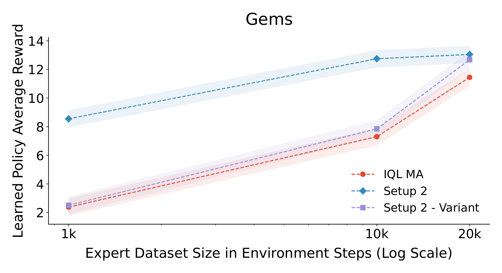
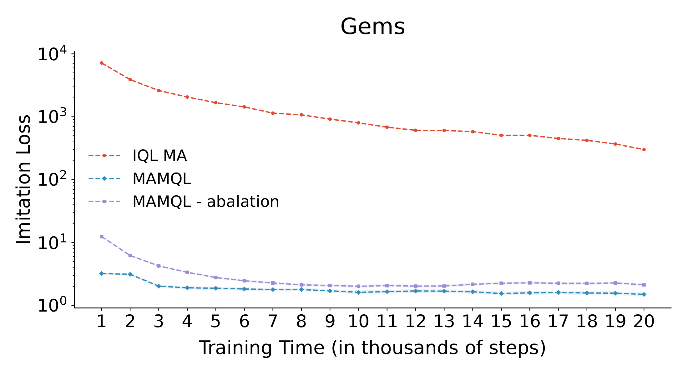
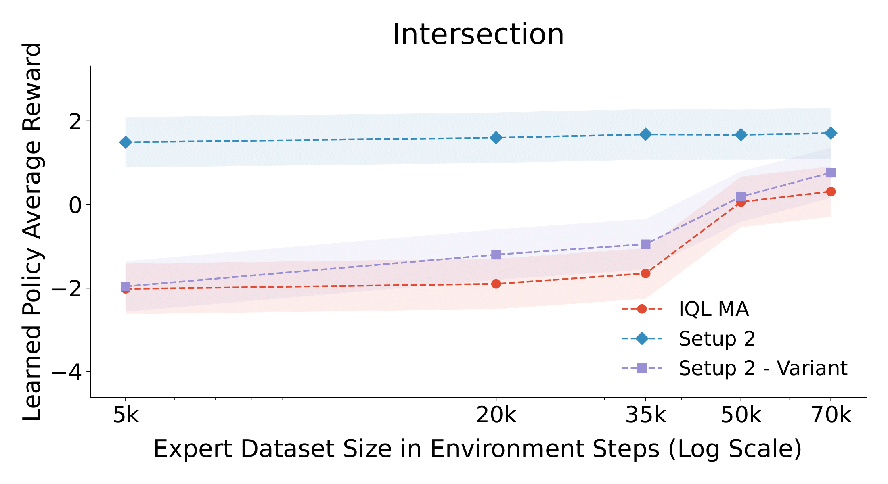
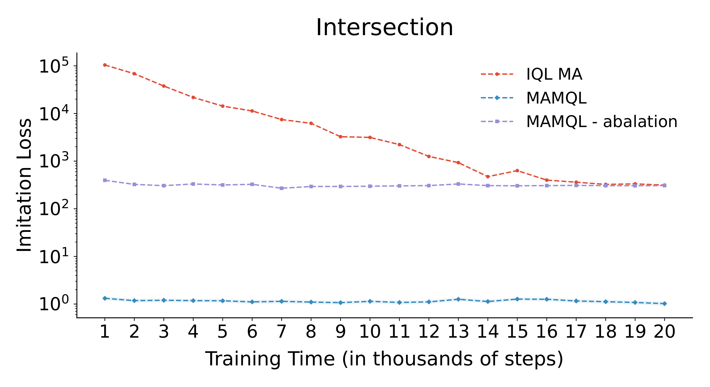
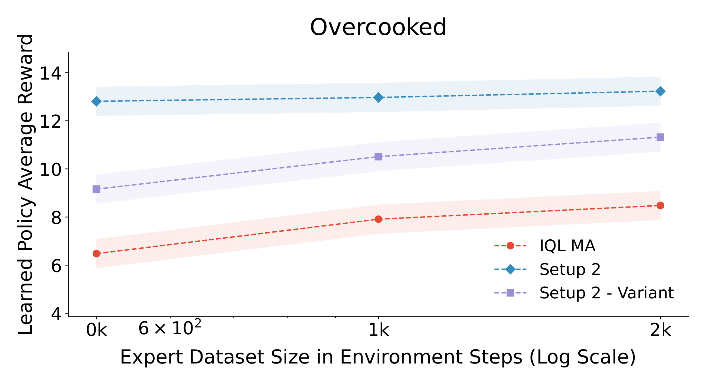
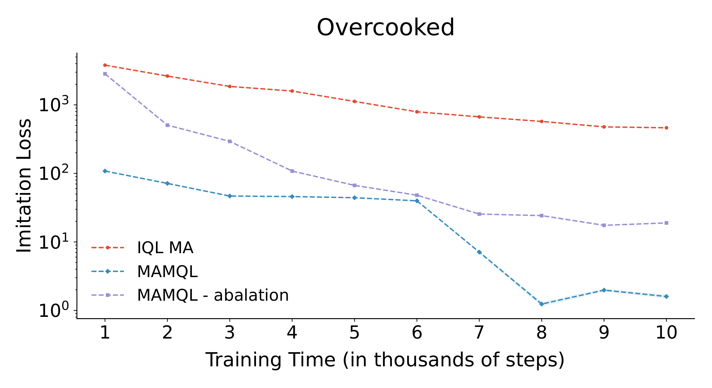

# Multi-Agent Marginal Q-Learning from Demonstrations

Official code base for MAMQL: Multi-Agent Marginal Q-Learning from Demonstrations

**MAMQL** is a sample efficienct multi-agent inverse reinforcement learning algorithm that achieves state of the art average reward and
reward recovery on several benchmarks.

## Install Dependencies
1. Install Python 3.10 or a more recent version.
2. Clone the MAMQL repo and install the Python packages in `requirements.txt`. You can use the following bash command: 

    ```bash
    $ pip install -r requirements.txt
    ```

3. Clone and install other environment packages to run intersection and overcooked.

    ```bash
    $ git clone https://github.com/HumanCompatibleAI/overcooked_ai.git
    $ pip install -e overcooked_ai/
    $ pip install highway-env
    ```

4. Install PyTorch. The version of PyTorch.
    
    ```bash
    $ pip3 install torch torchvision torchaudio --index-url https://download.pytorch.org/whl/cu121
    ```


## Training and Running
1. To train MAMQL on environment run the main file with args to select environment. An example train command for the intersection environment:

    ```bash
    $ python main.py --setup 4 --config_path intersection\configs\setup2.json --env_name intersection
    ```

2. To test your model and generate gifs of the results, update the corresponding train_env file with the path name for the model and run the following command (for the same intersection env):

     ```bash
    $ python main.py --setup 4 --config_path intersection\configs\setup2.json --env_name intersection --mode test
    ```

## Gems Environment Results

 

## Intersection Environment Results

 

## Overcooked Environment Results

 
